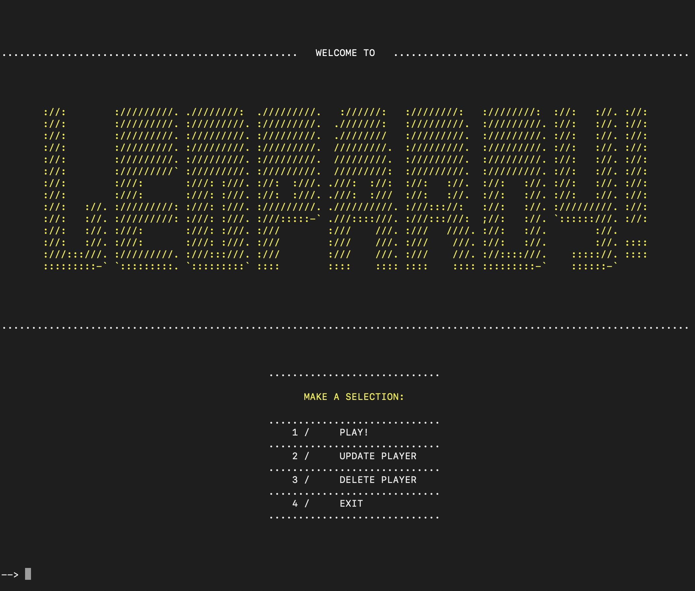
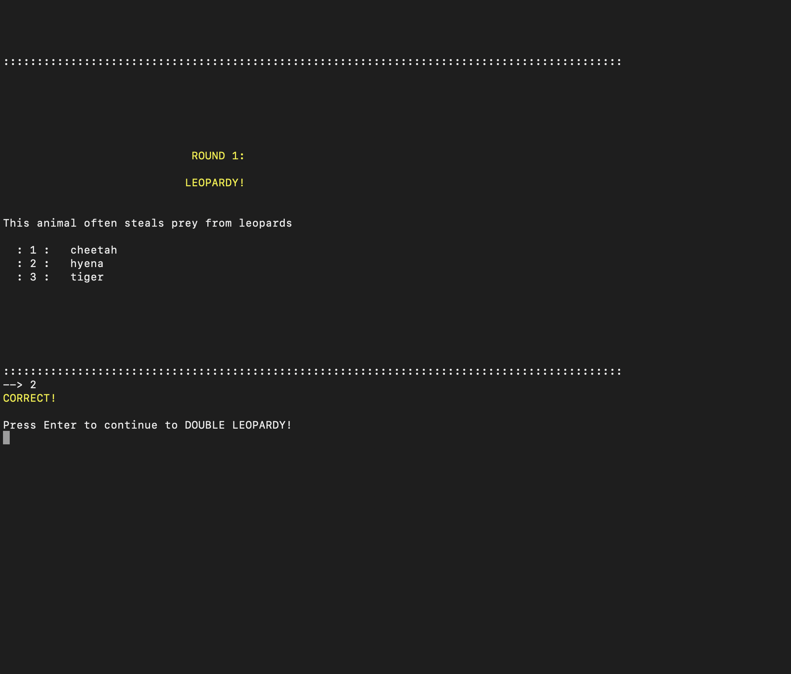
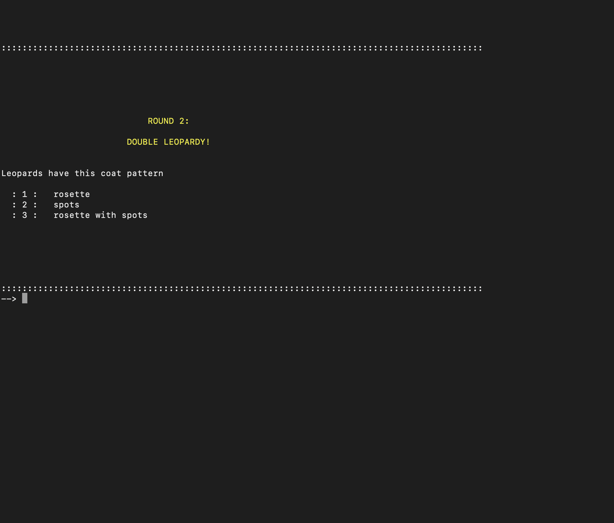
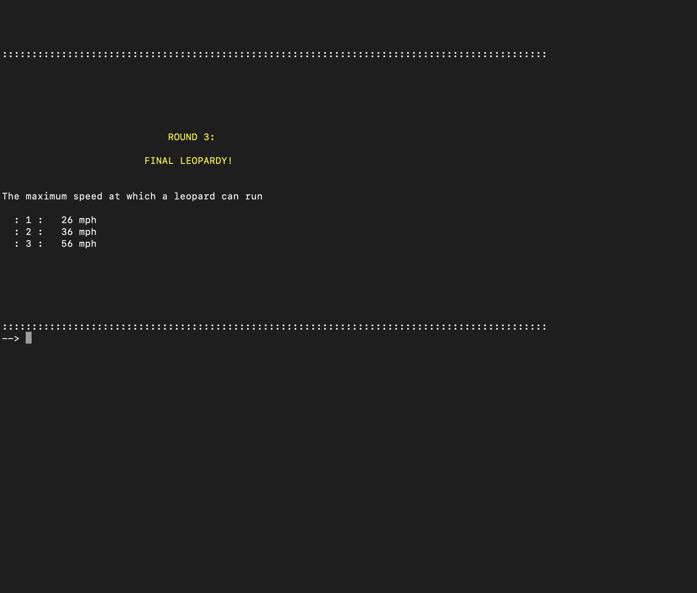

# WELCOME TO LEOPARDY!

LEOPARDY! is a multiple-choice trivia game that tests your knowledge about leopards. It was inspired by the popular trivia game show Jeopardy! and Pup Quiz from The Tonight Show Starring Jimmy Fallon.  

USER STORIES:  
User can view question clues  
User can create, update, and delete an account  

  
  
  
  

## Technologies 
Ruby, ActiveRecord  

## Installation

1. Fork and clone this repository.
2. In the terminal, save the cloned repository to a local folder by running:   
    ``` bash
    git clone <repo_url>
    ```
3. Inside the cloned repository folder in the terminal, run the following to install the dependencies:
    ```bash 
    bundle install
    rake db:migrate
    rake db:seed
    ```
4. Load the game by running:
    ```bash 
    ruby bin/run.rb
    ```

## Usage

1. In the welcome page, make a selection from the main menu. The menu options include: 
    ```bash
    1. PLAY!
    2. UPDATE PLAYER
    3. DELETE PLAYER
    4. EXIT
    ```
3. To start a game, select PLAY! from the menu and enter a name.
4. The game starts at the LEOPARDY! round. The first question clue and three multiple choice answers will be generated. Select an answer and it will be revealed to be correct or incorrect.
6. Press Enter to continue to the next round, DOUBLE LEOPARDY!. The second question clue and three multiple choice answers will be generated. Select an answer and it will be revealed to be correct or incorrect.
8. Press Enter to continue to the last round, FINAL LEOPARDY! A final question clue and three multiple choice answers will be generated. Select an answer and it will be revealed to be correct or incorrect. The game has finished, press Enter to exit the game.
10. To play again, press Enter to return to the main menu and select "PLAY!."
